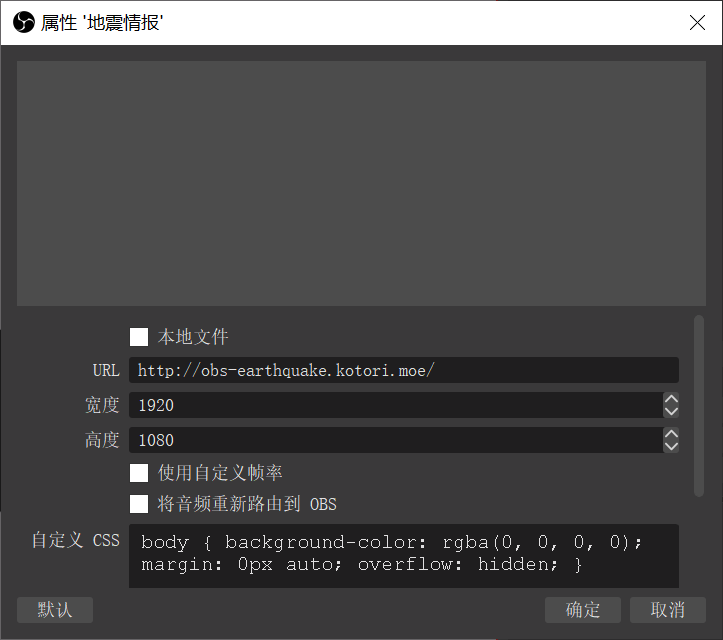

## OBS 地震情报字幕

本插件可以在OBS的画面上方插入显示地震信息。

### 显示内容

目前，本插件显示以下内容

* 震度速报
* 震中信息
* 各地区震度信息

### 数据来源

本插件数据来源于日本气象厅，经由 Shiny 数据处理后分发。使用数据时请遵循日本气象厅的相关规定。

### 使用方法

1. 在 OBS 中新增一浏览器源，**置于最上层**。URL 填入 https://obs-earthquake.kotori.moe/ ，宽高设定为 1920x1080，如下图所示。



2. 调整浏览器源大小使其与画面大小一致。

### 本地部署

您也可以本地部署本项目，但数据源依旧需要从 Shiny 的相关 API 获取，因为私有部署 Shiny 的整套系统过于复杂。

```bash
git clone https://github.com/Shiny-Project/obs-earthquake
cd obs-earthquake
npm i
npm run build
npm run serve
```

之后，在浏览器源的 URL 中填入 http://localhost:3111/ 。